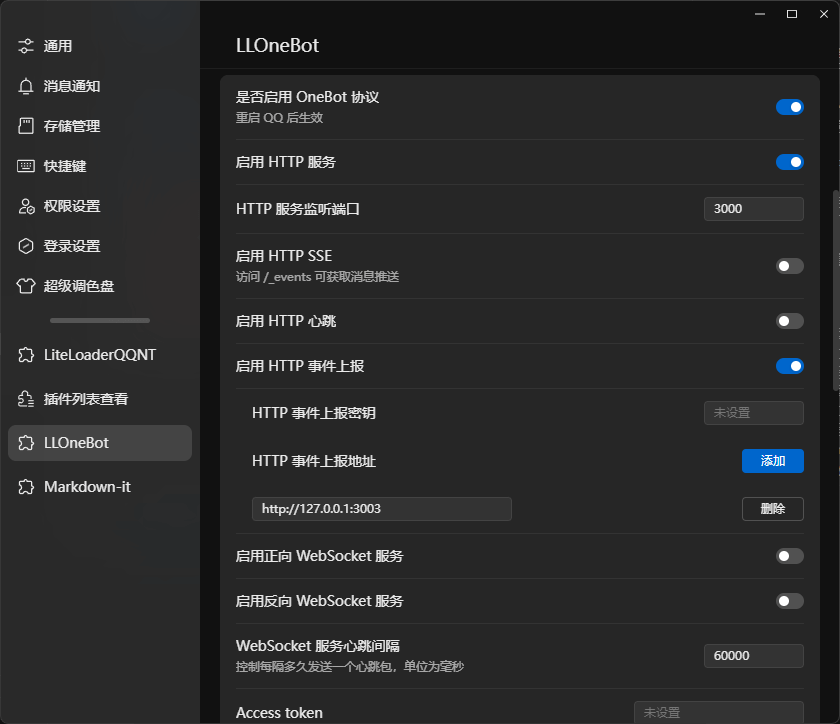
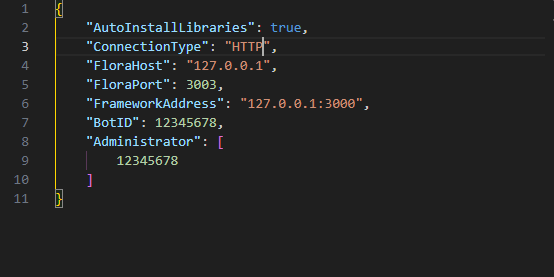
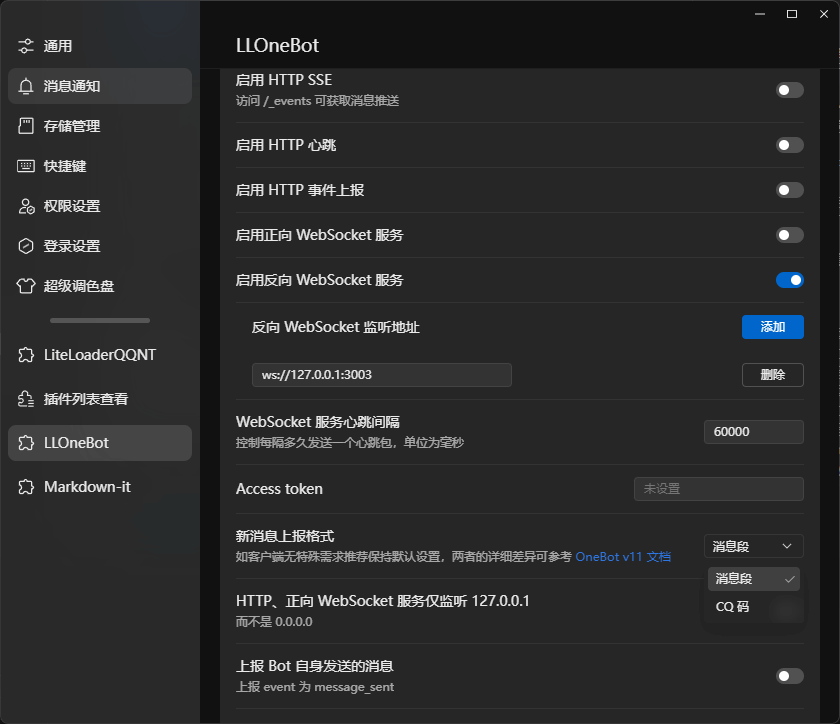
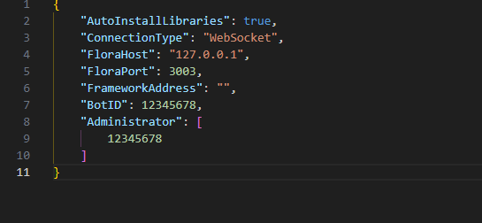

# 对接框架

::: warning
此文档适用于 FloraBot V1.13 及以上版本
:::

当前 FloraBot 仅支持通过 `HTTP` 与 `反向 WebSocket `协议与框架进行对接

## 接入lloneBot

### HTTP 接入

FloraBot 与 lloneBot 进行对接：
1. 在 lloneBot 的配置中将 `HTTP服务` 开启
2. 在 FloraBot 的配置文件中将 `ConnectionType` 设置为 `HTTP` 
3. 在 lloneBot 的配置中将上报地址设置为 `http://FloraHost:FloraPort`
4. 在 llonebot 的配置中将 `HTTP心跳` 关闭
5. 在 FloraBot 的配置文件中将 `FrameworkAddress` 修改为 `http://llonebot主机IP:HTTP服务监听端口`
6. 在 FloraBot 的配置文件中将 `BotID` 修改为机器人ID
7. 在 FloraBot 的配置文件中在 `Administrator` 中添加管理员ID

示例图

llonebot: 

FloraBot: 

修改后启动FloraBot等待连接

### 反向 WebSocket 接入

FloraBot 与 lloneBot 进行对接：
1. 在 lloneBot 的配置中将 `反向WebSocket服务` 开启
2. 在 FloraBot 的配置文件中将 `ConnectionType` 设置为 `反向WebSocket` 
3. 在 lloneBot 的配置中将 `反向WebSocket监听地址` 设置为 `ws://FloraHost:FloraPort/`
4. 在 FloraBot 的配置文件中将 `BotID` 修改为机器人ID
5. 在 FloraBot 的配置文件中在 `Administrator` 中添加管理员ID

示例图

llonebot: 

FloraBot: 

修改后启动FloraBot等待连接

